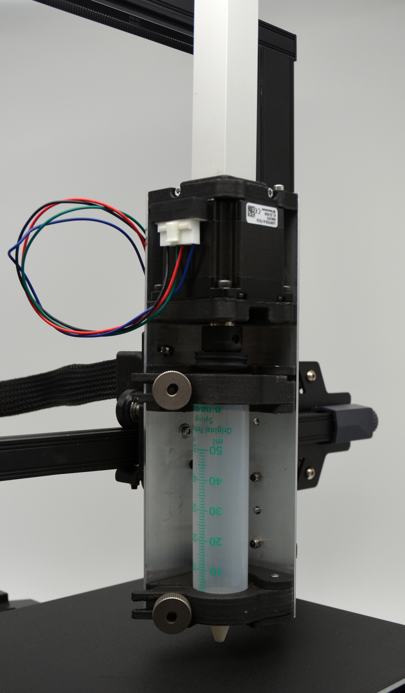

# 3D-PEDT

***3D-Paste Extrusion Development Toolhead***

New materials are constantly being developed for additive manufacturing. Therefore, they are ideally trialled and tested in small quantities first. Particularly in the development of pastes from bio-based residues, the rapid adaptation of the material with regard to process parameters is of crucial importance.

Based on a low-cost, commercially available material extruder for plastics (MEX-TRB/P), the ***3D-PEDT*** is developed for processing pastes with the aim of minimising the work steps involved in installing the material container and keeping assembly, disassembly and cleaning as simple as possible. 

All components required for the ***3D-PEDT*** can either be manufactured with MEX-TRB/P or are available as easily accessible purchased parts. The required STL files, CAD files  for the components are available here as open source. The other purchased parts required are also listed here.   
The extruder is controlled via _Klipper_ on _Repetier Server_. The ***3D-PEDT*** is designed for the _Creality Ender 3 S1_. The connection parts must be adapted for other MEX-TRB/P printers. 

  
  
  
  

  A project of the Institute for Machine Elements, Egineering Design and Manufacturing, TU Bergakademie Freiberg, Germany.

